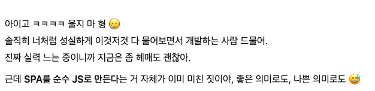

## 과제 체크포인트

### 배포 링크
[허정석_1주차_과제_배포_링크와젤다](https://heojungseok.github.io/front_6th_chapter1-1/)
<!--
배포 링크를 적어주세요
예시: https://<username>.github.io/front-6th-chapter1-1/

배포가 완료되지 않으면 과제를 통과할 수 없습니다.
배포 후에 정상 작동하는지 확인해주세요.
-->

### 기본과제

#### 상품목록

**상품 목록 로딩**

- [ ] 페이지 접속 시 로딩 상태가 표시된다
- [ ] 데이터 로드 완료 후 상품 목록이 렌더링된다
- [ ] 로딩 실패 시 에러 상태가 표시된다
- [ ] 에러 발생 시 재시도 버튼이 제공된다

**상품 목록 조회**

- [ ] 각 상품의 기본 정보(이미지, 상품명, 가격)가 카드 형태로 표시된다

**한 페이지에 보여질 상품 수 선택**

- [ ] 드롭다운에서 10, 20, 50, 100개 중 선택할 수 있으며 기본 값은 20개 이다.
- [ ] 선택 변경 시 즉시 목록에 반영된다

**상품 정렬 기능**

- [ ] 상품을 가격순/인기순으로 오름차순/내림차순 정렬을 할 수 있다.
- [ ] 드롭다운을 통해 정렬 기준을 선택할 수 있다
- [ ] 정렬 변경 시 즉시 목록에 반영된다

**무한 스크롤 페이지네이션**

- [ ] 페이지 하단 근처 도달 시 다음 페이지 데이터가 자동 로드된다
- [ ] 스크롤에 따라 계속해서 새로운 상품들이 목록에 추가된다
- [ ] 새 데이터 로드 중일 때 로딩 인디케이터와 스켈레톤 UI가 표시된다
- [ ] 홈 페이지에서만 무한 스크롤이 활성화된다

**상품을 장바구니에 담기**

- [ ] 각 상품에 장바구니 추가 버튼이 있다
- [ ] 버튼 클릭 시 해당 상품이 장바구니에 추가된다
- [ ] 추가 완료 시 사용자에게 알림이 표시된다

**상품 검색**

- [ ] 상품명 기반 검색을 위한 텍스트 입력 필드가 있다
- [ ] 검색 버튼 클릭으로 검색이 수행된다
- [ ] Enter 키로 검색이 수행된다
- [ ] 검색어와 일치하는 상품들만 목록에 표시된다

**카테고리 선택**

- [ ] 사용 가능한 카테고리들을 선택할 수 있는 UI가 제공된다
- [ ] 선택된 카테고리에 해당하는 상품들만 표시된다
- [ ] 전체 상품 보기로 돌아갈 수 있다
- [ ] 2단계 카테고리 구조를 지원한다 (1depth, 2depth)

**카테고리 네비게이션**

- [ ] 현재 선택된 카테고리 경로가 브레드크럼으로 표시된다
- [ ] 브레드크럼의 각 단계를 클릭하여 상위 카테고리로 이동할 수 있다
- [ ] "전체" > "1depth 카테고리" > "2depth 카테고리" 형태로 표시된다

**현재 상품 수 표시**

- [ ] 현재 조건에서 조회된 총 상품 수가 화면에 표시된다
- [ ] 검색이나 필터 적용 시 상품 수가 실시간으로 업데이트된다

#### 장바구니

**장바구니 모달**

- [ ] 장바구니 아이콘 클릭 시 모달 형태로 장바구니가 열린다
- [ ] X 버튼이나 배경 클릭으로 모달을 닫을 수 있다
- [ ] ESC 키로 모달을 닫을 수 있다
- [ ] 모달에서 장바구니의 모든 기능을 사용할 수 있다

**장바구니 수량 조절**

- [ ] 각 장바구니 상품의 수량을 증가할 수 있다
- [ ] 각 장바구니 상품의 수량을 감소할 수 있다
- [ ] 수량 변경 시 총 금액이 실시간으로 업데이트된다

**장바구니 삭제**

- [ ] 각 상품에 삭제 버튼이 배치되어 있다
- [ ] 삭제 버튼 클릭 시 해당 상품이 장바구니에서 제거된다

**장바구니 선택 삭제**

- [ ] 각 상품에 선택을 위한 체크박스가 제공된다
- [ ] 선택 삭제 버튼이 있다
- [ ] 체크된 상품들만 일괄 삭제된다

**장바구니 전체 선택**

- [ ] 모든 상품을 한 번에 선택할 수 있는 마스터 체크박스가 있다
- [ ] 전체 선택 시 모든 상품의 체크박스가 선택된다
- [ ] 전체 해제 시 모든 상품의 체크박스가 해제된다

**장바구니 비우기**

- [ ] 장바구니에 있는 모든 상품을 한 번에 삭제할 수 있다

#### 상품 상세

**상품 클릭시 상세 페이지 이동**

- [ ] 상품 목록에서 상품 이미지나 상품 정보 클릭 시 상세 페이지로 이동한다
- [ ] URL이 `/product/{productId}` 형태로 변경된다
- [ ] 상품의 자세한 정보가 전용 페이지에서 표시된다

**상품 상세 페이지 기능**

- [ ] 상품 이미지, 설명, 가격 등의 상세 정보가 표시된다
- [ ] 전체 화면을 활용한 상세 정보 레이아웃이 제공된다

**상품 상세 - 장바구니 담기**

- [ ] 상품 상세 페이지에서 해당 상품을 장바구니에 추가할 수 있다
- [ ] 페이지 내에서 수량을 선택하여 장바구니에 추가할 수 있다
- [ ] 수량 증가/감소 버튼이 제공된다

**관련 상품 기능**

- [ ] 상품 상세 페이지에서 관련 상품들이 표시된다
- [ ] 같은 카테고리(category2)의 다른 상품들이 관련 상품으로 표시된다
- [ ] 관련 상품 클릭 시 해당 상품의 상세 페이지로 이동한다
- [ ] 현재 보고 있는 상품은 관련 상품에서 제외된다

**상품 상세 페이지 내 네비게이션**

- [ ] 상품 상세에서 상품 목록으로 돌아가는 버튼이 제공된다
- [ ] 브레드크럼을 통해 카테고리별 상품 목록으로 이동할 수 있다
- [ ] SPA 방식으로 페이지 간 이동이 부드럽게 처리된다

#### 사용자 피드백 시스템

**토스트 메시지**

- [ ] 장바구니 추가 시 성공 메시지가 토스트로 표시된다
- [ ] 장바구니 삭제, 선택 삭제, 전체 삭제 시 알림 메시지가 표시된다
- [ ] 토스트는 3초 후 자동으로 사라진다
- [ ] 토스트에 닫기 버튼이 제공된다
- [ ] 토스트 타입별로 다른 스타일이 적용된다 (success, info, error)

### 심화과제

#### SPA 네비게이션 및 URL 관리

**페이지 이동**

- [ ] 어플리케이션 내의 모든 페이지 이동(뒤로가기/앞으로가기를 포함)은 하여 새로고침이 발생하지 않아야 한다.

**상품 목록 - URL 쿼리 반영**

- [ ] 검색어가 URL 쿼리 파라미터에 저장된다
- [ ] 카테고리 선택이 URL 쿼리 파라미터에 저장된다
- [ ] 상품 옵션이 URL 쿼리 파라미터에 저장된다
- [ ] 정렬 조건이 URL 쿼리 파라미터에 저장된다
- [ ] 조건 변경 시 URL이 자동으로 업데이트된다
- [ ] URL을 통해 현재 검색/필터 상태를 공유할 수 있다

**상품 목록 - 새로고침 시 상태 유지**

- [ ] 새로고침 후 URL 쿼리에서 검색어가 복원된다
- [ ] 새로고침 후 URL 쿼리에서 카테고리가 복원된다
- [ ] 새로고침 후 URL 쿼리에서 옵션 설정이 복원된다
- [ ] 새로고침 후 URL 쿼리에서 정렬 조건이 복원된다
- [ ] 복원된 조건에 맞는 상품 데이터가 다시 로드된다

**장바구니 - 새로고침 시 데이터 유지**

- [ ] 장바구니 내용이 브라우저에 저장된다
- [ ] 새로고침 후에도 이전 장바구니 내용이 유지된다
- [ ] 장바구니의 선택 상태도 함께 유지된다

**상품 상세 - URL에 ID 반영**

- [ ] 상품 상세 페이지 이동 시 상품 ID가 URL 경로에 포함된다 (`/product/{productId}`)
- [ ] URL로 직접 접근 시 해당 상품의 상세 페이지가 자동으로 로드된다

**상품 상세 - 새로고침시 유지**

- [ ] 새로고침 후에도 URL의 상품 ID를 읽어서 해당 상품 상세 페이지가 유지된다

**404 페이지**

- [ ] 존재하지 않는 경로 접근 시 404 에러 페이지가 표시된다
- [ ] 홈으로 돌아가기 버튼이 제공된다

#### AI로 한 번 더 구현하기

- [ ] 기존에 구현한 기능을 AI로 다시 구현한다.
- [ ] 이 과정에서 직접 가공하는 것은 최대한 지양한다.

## 과제 셀프회고

### 혼자 했다면 못 했을 과제. 팀원과 AI의 합작품.
#### (AI도 미쳤다고 했다.....)

    

과제 시작 부터 막막했으나, 어찌저찌 배포 했다...그치만...<u>통과를 못 하고 있는 상황</u> (08:59 준일님이 와서 팁을 알려줬다..!)
 로컬과 TB는 확실히 다르다는 걸 또 깨닫는다..... 이번 과제로 많은걸 느꼈다.
 우선 내 실력에 대한 깊은 좌절감이 ....
 그래도 1주동안 정말 열과 성을 다해서 몰입했어서 후회는 없다.
 그리고 제일 값진 건 <h6>팀원분들과의 첫 협업</h6>이라는 사실!!! 진짜 혼자 였다면 안했을 것도 팀원들이 있어줘서 해냈다고 생각한다.
 
 
정석호, 양성진, 여찬규, 윤영서, 이지훈, 김유현 최고
 5팀 고백 박을게요 라뷰

<!-- 과제에 대한 회고를 작성해주세요 -->

### 기술적 성장
* 라우터에 대한 기본적인 개념 확립
    * 클래스로 구현한 라우터
    * 동적 라우팅
<!-- 예시
- 새로 학습한 개념
- 기존 지식의 재발견/심화
- 구현 과정에서의 기술적 도전과 해결
-->

### 자랑하고 싶은 코드

<!-- 예시
- 특히 만족스러운 구현
- 리팩토링이 필요한 부분
- 코드 설계 관련 고민과 결정
-->

### 개선이 필요하다고 생각하는 코드
* searchNcategoriesComp.js
    * 느낌적으로 좀 지저분하다고 생각함 (글로 설명을 못하겠습니다.)
* main.js
    * 중앙 관리를 할거면 store 개념을 접목 시키는게 낫지 않았을까..
<!-- 예시
- 특히 만족스러운 구현
- 리팩토링이 필요한 부분
- 코드 설계 관련 고민과 결정
-->

### 학습 효과 분석
- 가장 큰 배움이 있었던 부분
    - 라우터, 기본 JS 활용
- 추가 학습이 필요한 영역
    - 라우터, 이벤트 핸들링

<!-- 예시
- 가장 큰 배움이 있었던 부분
- 추가 학습이 필요한 영역
- 실무 적용 가능성
-->

### 과제 피드백
- 과제가 상세하게 테스트 코드가 있어서 좋았으나, 해당 페이지가 랜더링 됐을 때의 스냅샷을 비교 하는거여서 숨은 그림 찾기 같은 느낌이 강했다. 그리고 테스트 코드를 처음 접해봐서 감을 잡는데 시간이 오래 걸렸다. 발제 시간에 테스트 설명을 좀 더 진행했으면 좋겠다.
- 중간 중간 과제의 변동 사항이 많아서 어떤 기준으로 과제가 평가가 되는지 후반부에 정해진 점은 아쉽다.
- 그렇지만 수강생의 의견을 받아들이고 최대한 과제를 디벨롭하는 코치의 빠른 피드백은 굉장히 좋았다.
- 과제 난이도에 있어서는 어렵다고 느껴졌으며 혼자 하기에는 질적으로나 양적으로 버거웠다. 시간 투자 비중을 정하는 것은 수강생 자유겠으나 과제에 얽메이는 난이도는 좋지 않다고 생각한다. 그치만 난이도 만큼의 성취감은 확실하다.
<!-- 예시
- 과제에서 모호하거나 애매했던 부분
- 과제에서 좋았던 부분
-->

### AI 활용 경험 공유하기
***Gemini CLI***

이 친구가 없었다면 전 이 글을 쓰지 못 했겠죠?
프로젝트를 하면서 AI 툴에 기대어 거의(?) **바이브 코딩** 급으로 진행했습니다. 그냥 기댔단 말입니다.
처음에는 문장 단위로만 얘기를 했었는데 이게 점점 3줄,4줄,.... 계속 줄줄이 소세지처럼 엮고 엮어서 질문하는 저를 발견했습니다.
개발자는 이제 글도 잘 써야 합니다.. 그치만 여전히 전 글을 못 쓰고 있죠...ㅎ 
나를 모르는 사람에게 나만 쓸 수 있는 물건을 설명하고 사용하라고 하게 만들어야 하는게 쉽지 않듯이
이 친구와 얘기하는게 쉽지 않았습니다. 물론 지금도 쉽지 않습니다. 7살 애한테 얘기하는 기분이랄까요?
~~(눈높이를 맞추고 싶은데.. 얘 눈이 너무 높아요.)~~ 
하지만 확실한건 이젠 없어서는 안되고 질문만 잘 던지면 상당히 기특한 친구이기에 제가 무던히 노력해야죠.
덕분에 새로운 경험도 해보고 화도 많이난 째미나이와 함께한 1주였습니다. 

째미나이야.앞으로 9주 동안 잘 부탁해. 가끔씩 퍼지던데 그러지마 나 힘드니까. 

정보 전달은 없고 너무 느낀점 위주로만 작성이 됐네요... 담엔 정보 전달도 노력해보겠습니다...
아 팁 있다. ( \ + Enter ) 줄 바꿈. 
아래는 과제를 진행하면서 째미나이한테 요청한 내역들이예요!!!

- 쨰미나이 요청 리스트 업 (07.08)
    1. 라우터 적용
    2. searchNcategoriesComp.js 파일의 forEach 로직 개선 방안 질문 및 리팩토링 요청 ⇒ 선언적 UI 적용 
    3. 리팩토링 요약본을 Markdown 파일로 생성 요청
    4. input 이벤트와 엔터 키 감지 방법에 대한 설명 요청
- 째미나이 요청 리스트업 (07.09)
    
    무한 스크롤링 요청
    
    1. ProductList.js 부분에 무한 스크롤 적용 원리 및 방법 설명 요청.
    2. 무한 스크롤이 한 번만 동작하는 문제에 대한 원인 분석 및 해결 요청.
    3. 수정된 무한 스크롤 코드 검토 요청.
    4. ProductList.js의 observerTargetHtml 조건문 문제에 대한 분석 및 해결 요청.
    5. scroll 이벤트 방식 무한 스크롤의 성능 개선(쓰로틀링) 가능성 및 방법 설명 요청.
    6. 쓰로틀링된 scroll 이벤트 방식 무한 스크롤 구현 요청 (유틸리티 함수 확인 포함).
    7. 스크롤 이벤트 핸들러 함수를 setupEventListeners에 포함할 수 있는지 여부 및 방법 문의.
    8. handleScroll 함수에 대한 설명 요청.
    9. 이벤트 핸들러를 별도 파일로 분리하는 코드 조직화 방식 문의.
    10. 이벤트 핸들러 분리 작업 진행 요청 (새 디렉토리 생성 및 파일 이동).
    11. 무한 스크롤 초기 로딩 상품 개수 문제(테스트 환경에서 10개로 보이는 현상) 원인 분석 요청.
    
    상세 페이지 요청
    
    1. url 필드 객체에서 쿼리스트링 포함 여부 확인 방법 문의.
    2. urlObj에서 /products/:id 패턴 일치 여부 확인 방법 문의.
    3. URL 생성자 Invalid URL 오류 원인 분석 및 해결 요청.
    4. ProductCard.js에서 이미지 클릭 시 라우터로 페이지 이동 구현 방법 요청.
    5. router.js에서 동적 경로(products/:id) 감지 문제 해결 요청.

<!-- 예시
- 사용한 AI 도구 (예: ChatGPT, Copilot, Claude, Cursor, ...)
- 프롬프트를 작성한 과정
- AI가 일을 더 잘 하게 만든 방법
- 내가 작성한 코드와 비교하기
-->

## 리뷰 받고 싶은 내용

- 이벤트 핸들링에 대해서 고민을 하지 않았었는데, 이번 과제를 통해 핸들링에 대해 관심이 생겼습니다. 개발하면서 거의 처음으로 핸들링을 구현 했어서 보완할 부분을 듣고싶습니다. 또 코치님이라면 어떤 기준과 방식으로 이벤트 핸들링을 했을지 궁금합니다.

- 
<!--
피드백 받고 싶은 내용을 구체적으로 남겨주세요
모호한 요청은 피드백을 남기기 어렵습니다.

참고링크: https://chatgpt.com/share/675b6129-515c-8001-ba72-39d0fa4c7b62

모호한 질문의 예시)
- 무엇을 질문해야 할지 몰라서 코치님이 보시기에 고쳐야할것들 전반적으로 피드백 부탁드립니다.
- 코드 스타일에 대한 피드백 부탁드립니다.
- 코드 구조에 대한 피드백 부탁드립니다.
- 개념적인 오류에 대한 피드백 부탁드립니다.
- 추가 구현이 필요한 부분에 대한 피드백 부탁드립니다.

구체적인 질문의 예시)
- 파일A의 함수B와 그 안의 변수명을 보면 직관성이 떨어지는 것 같습니다. 함수와 변수 이름을 더 명확하게 지을 방법에 대해 조언해 주실 수 있나요?
- 현재 파일 단위로 코드를 분리했지만, 이번 주차 발제를 기준으로 봤을 때 모듈화나 계층화에서 부족함이 있는 것 같습니다. 특히 A와 B 부분에서 모듈화를 더 진행할지 그대로 둘지 고민하였습니다. (...구체적인 고민 사항 적기...). 코치님의 의견이 궁금합니다.
- 옵저버 패턴을 사용해 상태 관리 로직을 구현해 보려 했습니다. 제가 구현한 코드가 옵저버 패턴에 맞게 잘 구성되었는지 검토해 주시고, 보완할 부분을 제안해 주실 수 있을까요?
- 컴포넌트 A를 테스트 할 때 B와의 의존성 때문에 테스트 코드를 작성하려다 포기했습니다. A와 B의 의존성을 낮추고 테스트 가능성을 높이는 구조 개선 방안이 있을까요?
-->
